# Transaction Service API overview
- Transaction service application is to store the transaction details and also to view the stored data.
- Handled operations : create transaction details and view transaction details.
- Build and deploy application using Azure CI/CD pipeline in Azure Kubernetes Cluster

## Technology Stack
- Java 11
- Spring Boot 2.7.9
- Junit 5.8.2
- Database H2

## Architectural Design
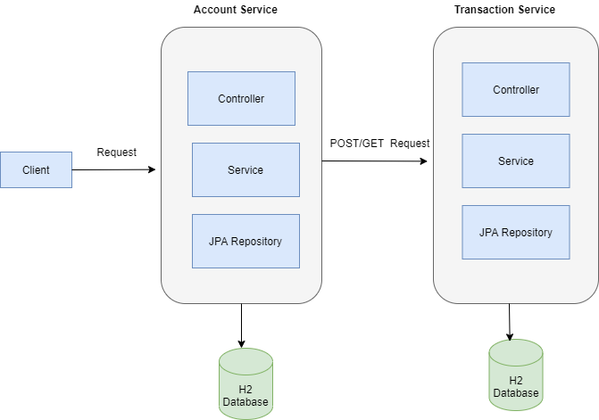
## CI/CD Flow
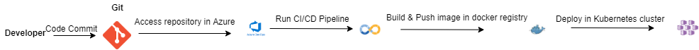

## Entity Relationship Diagram
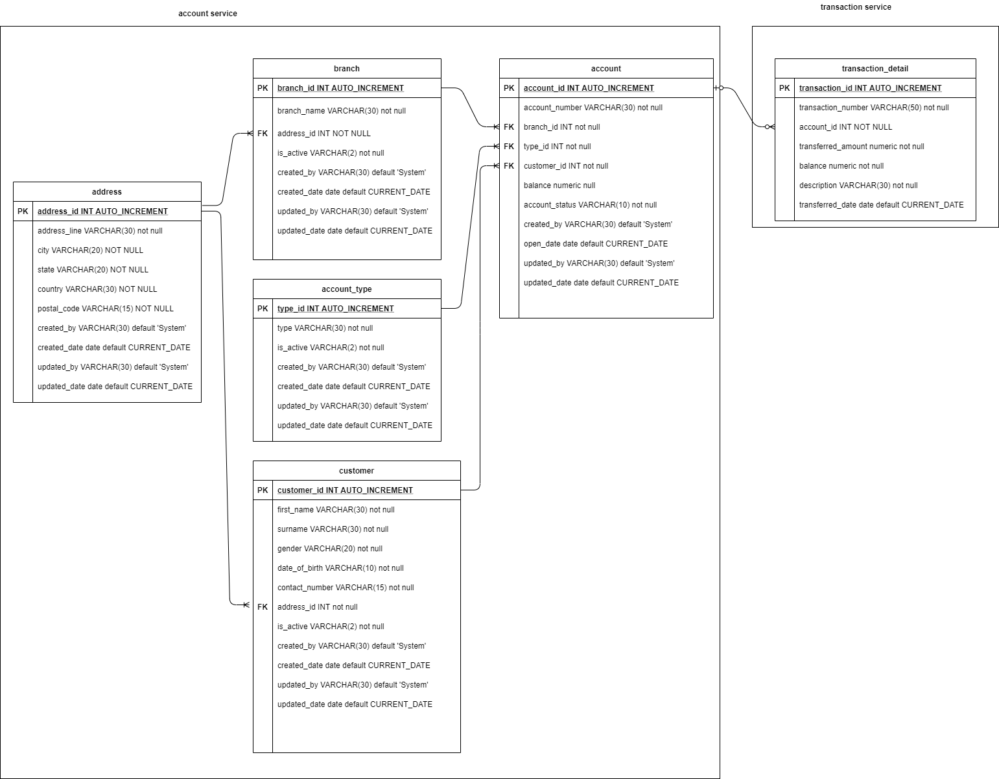

## Code Coverage
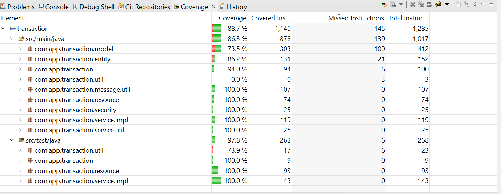

## Application Running Instructions - Both Account Service & Transaction Service
 
  - How to run application in local
    - mvn clean install
    - mvn spring-boot:run
  - Run application using CI/CD pipeline
  	- Create one Kubernete cluster in Microsoft azure account
  		- Resource group name :  kubernetes-rg
  		- Cluster name: kubernetes-cluster
  		- To Connect to the cluster run the commands as shown in below screenshot. It will create config file inside user directory of local system
  			Example:  C:\Users\<username>\.kube\config
  		- Copy this config file content to create service connection for kubernetes in azure 		
  			- 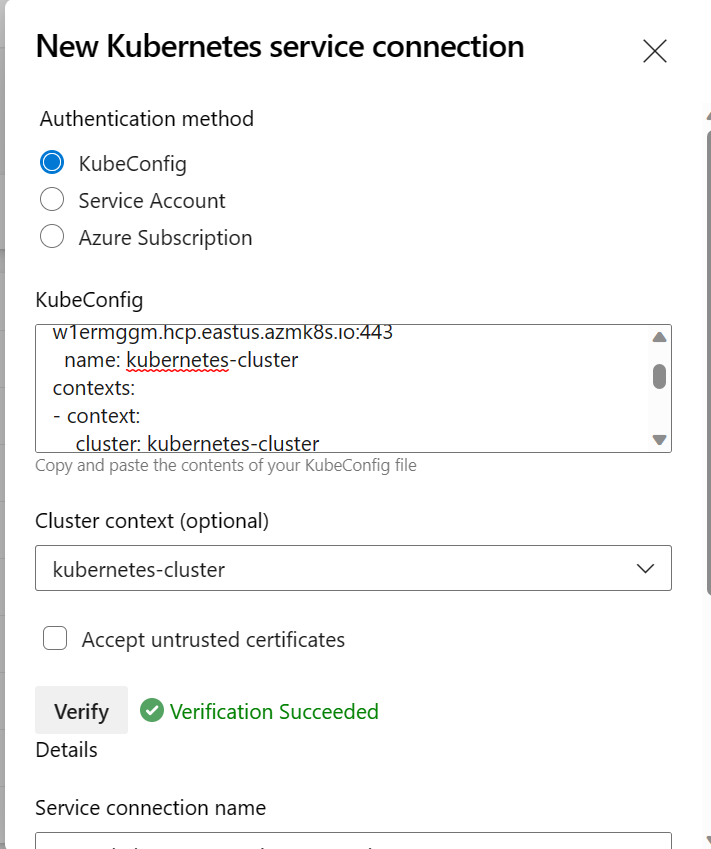 			
  		- Create Service connection for git repository to run pipeline
  		- Create Service connection for Docker registry to push image into registry
  			- Replace with your docker registry name account, transaction service in configuration/azure/account-pipeline.yml , transaction-pipeline.yml in Line No. 21,22
  			- Replace with your docker registry name account, transaction service in configuration/azure/deployment.yaml in Line No. 25
  		- To Create New Pipeline for transaction service in azure 
  		     - Pipelines -> New Pipeline -> Select GitHub-> select transaction repository-> Select Use Existing Azure Pipeline YAML->select configuration/azure/transaction-pipeline.yml -> Run
  		   		- You can see status of the pipeline
  		    	- 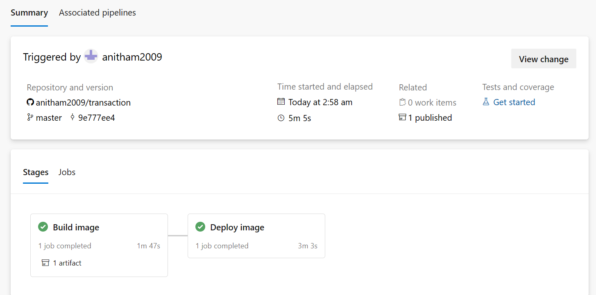  
  		- To Create New Pipeline for account service in azure 
  		     - Pipelines -> New Pipeline -> Select GitHub-> select account repository-> Select Use Existing Azure Pipeline YAML->select configuration/azure/account-pipeline.yml -> Run
  		   		- You can see status of the pipeline
  		    	- 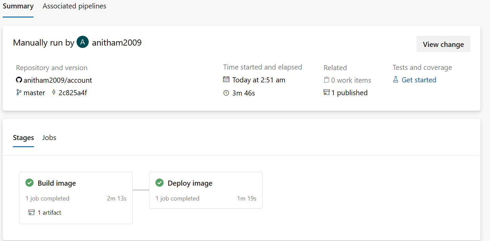 
  		- Execute below command in cloud shell 
  			- kubectl get svc
  				 - 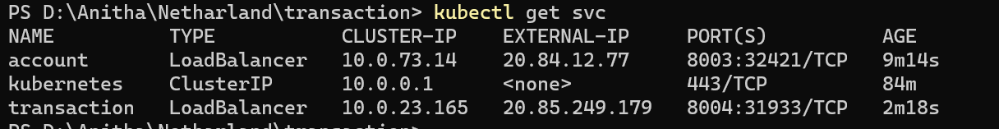
  			- Copy the EXTERNAL-IP of account service and port is 8003
  				- URL sample: http://20.84.12.77:8003/swagger-ui/
  				- 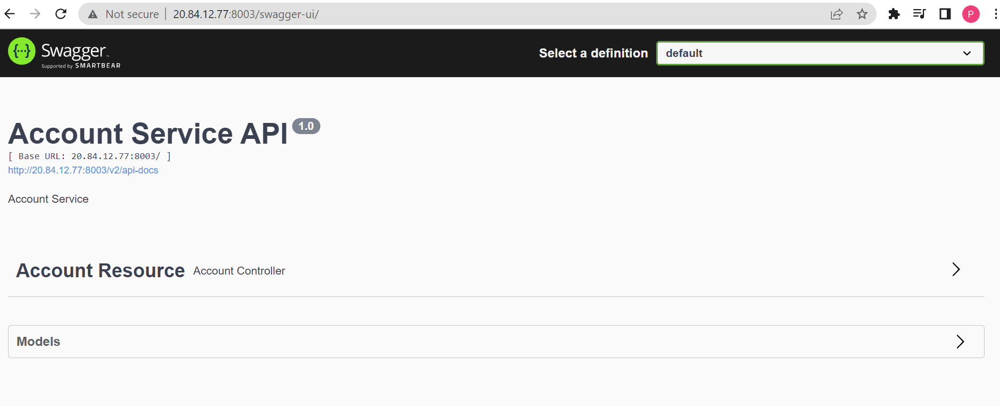
			- Copy the EXTERNAL-IP of transaction service and port is 8004
				- URL sample: http://20.85.249.179:8004/swagger-ui/
				- 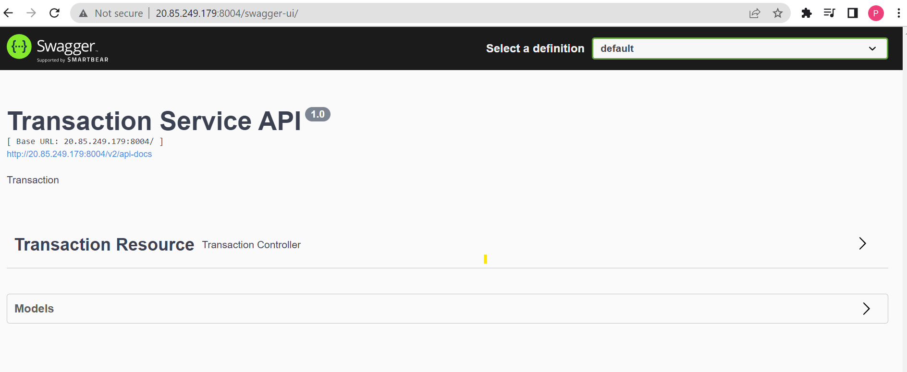
			- To check log execute below command 
				- kubectl get pods
				- kubectl logs -f <podnameofaccount>
				- kubectl logs -f <podnameoftransaction>
				
		- Its mandatory to run both account, transaction service to do create/ get operation
  			- Customer Id available are 1 , 2
  			- Create new account of customer id : 1 with initial credit some amount
  				- 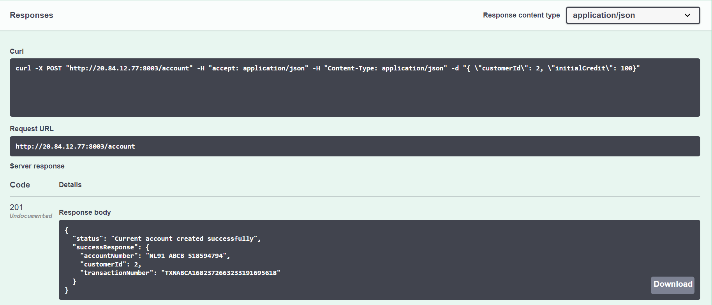
  			- Create new account with initial credit 0
  			- Get current of the customer 1
  				- 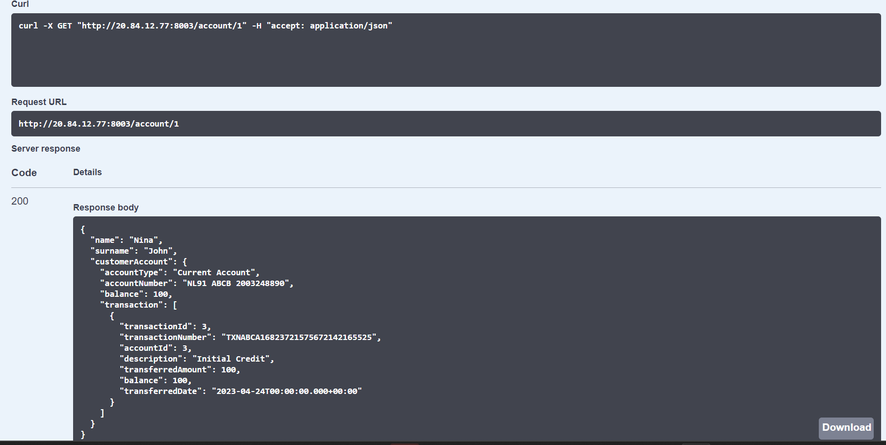
  				
## Monitoring application - Actuator
 - URL example
	- http://20.85.249.179:8004/actuator/health
	- http://20.84.12.77:8003/actuator/health
		  			 		      	
## Swagger Documentation
 - [Application URL](http://<hostname>:8003/swagger-ui/) (Prerequisite: The application should be running on port number : 8003)

## Accessing H2 Database
 - [Database URL](http://localhost:8003/h2)  (Prerequisite: The application should be running on port number : 8003 and localhost)

## Initial Data
 - transaction_detail table will be created
 
## Achieved Functionalities
   - Persist transaction details, if it notify the caller.
   - Get saved transaction details.
   - Unit test
   - Integration Test(TransactionControllerIntegrationTest.java)
   - Created CI/CD pipeline to deploy application in Azure Kubernetes service
   - Added actuator to monitor application
   - Swagger Documentation
   